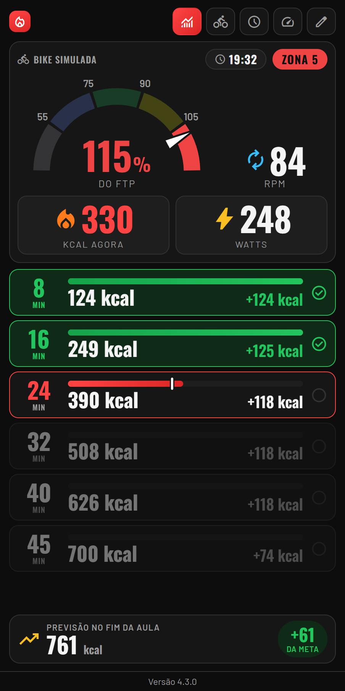
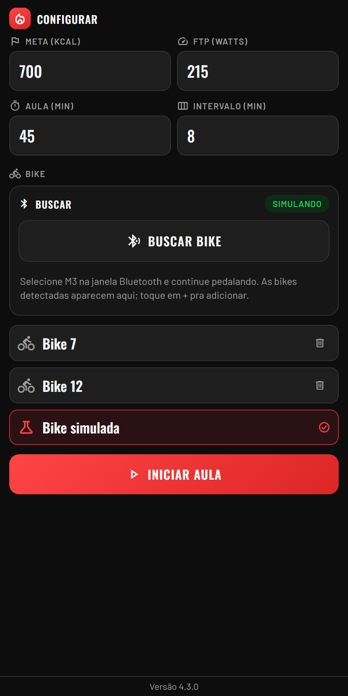
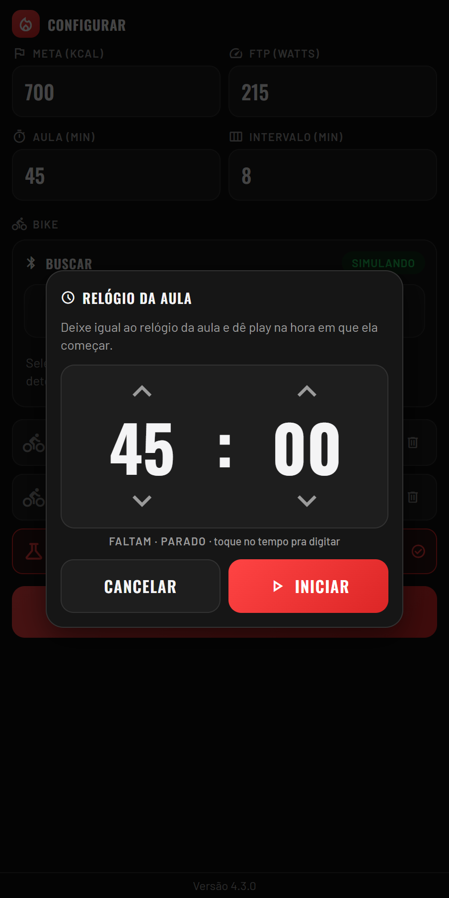

# Ritmo de Queima 🔥

> 🤖 Esta é uma aplicação **vibecodada** — construída de forma conversacional, iterando com IA em vez de escrita manual tradicional.

Painel de ritmo de calorias para bike indoor **Keiser M3**, com leitura ao vivo por Bluetooth. App 100% front-end (Vite + TypeScript + Preact, gera arquivos estáticos), pensado para uso no celular em uma única tela.

**▶ Abrir o app: https://altair-sossai.github.io/calorie-burn/** (no iPhone, abra pelo navegador Bluefy — veja [Compatibilidade](#compatibilidade-importante))

<table>
  <tr>
    <td align="center"></td>
    <td align="center"></td>
    <td align="center"></td>
  </tr>
  <tr>
    <td align="center"><b>Painel ao vivo</b></td>
    <td align="center"><b>Configurar</b></td>
    <td align="center"><b>Relógio da aula</b></td>
  </tr>
</table>

## O que faz

Dada uma **meta de calorias**, o **tempo da aula** e um **intervalo** em minutos, o app quebra a aula em blocos (ex. a cada 8 min) e mostra, pra cada um, a meta cumulativa e quanto falta fazer naquele bloco especificamente. A **kcal inicial** não é digitada: é a que a bike mostra no momento em que a aula começa.

### Início da aula: relógio sincronizado

Toda a preparação fica numa tela só (**Configurar**): meta, FTP, tempo da aula, intervalo e a bike. Ao tocar em **Iniciar aula**, a bike escolhida precisa estar **respondendo** (mandando leitura pelo Bluetooth agora) — se não estiver, a aula não começa e aparece um aviso pra pedalar e conferir a conexão. A Bike simulada sempre responde.

Com a bike ok, abre o **relógio da aula**, em contagem regressiva como o da sala (40:00, 39:59…), **parado** no tempo total. Enquanto a aula não começa, dá pra ajustar só o tempo, como num timer: as setas em cima e embaixo dos minutos e dos segundos somam ou tiram 1 (segurando, repetem), ou toque no tempo e digite o que falta (útil se você chegou com a aula já andando). Na hora em que a aula começa, toque em **Iniciar** (play): a aula é criada com a kcal que a bike mostra naquele instante e o relógio passa a andar. "Cancelar" volta pra Configurar sem começar nada.

Com o relógio andando, o **tempo da aula** (MM:SS) aparece no topo do painel, ao lado do selo da zona, e alimenta um **risco vertical** em cima da barra de kcal do marco atual, que mostra onde você deveria estar no bloco (4 min depois do minuto 8, o risco está na metade do bloco 8→16). Quando o risco chega ao fim, o marco é **concluído sozinho** e o app já recalcula e passa pro próximo.

Durante a aula, o **botão de relógio** no topo abre o mesmo relógio: os ajustes valem na hora, pra acompanhar o relógio da sala se ele estiver diferente. Pra digitar, aceita `38:15`, `38 15` e `3815` (MMSS) — e também `815` (MSS) ou só minutos (`3` = 3 min). O tempo acertado manda nos marcos: os que terminam até esse ponto ficam concluídos (os que faltavam são concluídos sozinhos, como no avanço normal) e os já confirmados que terminam depois dele são **desmarcados**, voltando as metas ao que eram antes deles — ex. com 8 e 16 confirmados, acertar o relógio em 35:00 (minuto 10) desmarca o 16 e o risco fica em 25% do bloco 8→16.

Os marcos também podem ser tocados: tocar no marco atual o confirma e acerta o relógio (toque no 8 = minuto 8 da aula); só dá pra confirmar o próximo da fila, em sequência, e só dá pra desfazer o último confirmado (pra corrigir um toque errado). Desfazer um marco **para o relógio**; pra ele voltar a andar, toque em outro marco ou abra o relógio, ajuste e dê play.

No painel ao vivo, o quadro da bike fica fixo em cima, a **previsão de kcal no fim da aula** fica fixa no rodapé e só a lista de marcos rola; ela acompanha sozinha o marco atual (o último concluído fica no topo), sem atrapalhar se você rolar na mão.

A previsão usa o relógio de referência: pega o ritmo médio da aula até agora (kcal feitas desde a kcal inicial ÷ minutos de aula) e projeta pro tempo que falta, mostrando também quanto fica acima (verde) ou abaixo (vermelho) da meta. Usa a média da aula inteira, e não só dos últimos minutos, porque a aula alterna zonas de propósito. Pra não distrair, ela **só aparece depois de 5 min de aula** (antes disso o ritmo ainda oscila demais; o rodapé mostra "previsão a partir dos 5 min") e **é atualizada a cada 15 s**, não a todo segundo — mas recalcula na hora quando você acerta ou desfaz o relógio. Com o relógio parado (depois de desfazer um marco), não há previsão. Depois do fim da aula, mostra o total.

A cada confirmação, o app recalcula os blocos seguintes com base na kcal real naquele momento: se você está adiantado, o que falta pros próximos blocos diminui; se está atrasado, aumenta. Ao superar a meta final, a lista sempre acrescenta um próximo nível de +50 kcal, pra continuar acompanhando quem passar do objetivo.

### Cadastro de bikes

As bikes só entram na lista **via Bluetooth**: você busca, toca em "+" na bike detectada e ela fica salva (pelo número que aparece no console dela, ex. "Bike 7"). Não dá pra cadastrar manualmente nem editar — só excluir. Existe sempre uma **Bike simulada** fixa como última opção da lista, útil pra testar o app sem uma bike de verdade por perto.

### Fluxo

1. **Configurar** (antes da aula, sem menu no topo) — meta (kcal), **FTP (watts)**, tempo da aula e intervalo (min); logo abaixo, a bike: busca via Bluetooth, adiciona as detectadas, exclui as que não usa mais e escolhe qual está em uso; e o botão "Iniciar aula", que abre o relógio.
2. **Painel ao vivo** — um cartão por marco (minuto final em destaque, meta cumulativa, quanto falta no bloco); e o essencial da bike: %FTP e rpm em destaque (o que o instrutor pede), kcal e watts logo abaixo, colados nos marcos.

Durante a aula, o topo só tem o que faz sentido mudar sem recomeçar: **painel**, **bike** (trocar de bike ou reconectar o Bluetooth, sem encerrar a aula), **relógio**, **FTP** e **editar aula** — este pede confirmação, encerra a aula (marcos e relógio são descartados) e volta pra Configurar. Metas, tempo e intervalo só mudam assim, recomeçando.

Com a bike conectada e o relógio acertado, você não digita nada durante a aula. Se uma leitura de kcal vier zerada (glitch do Bluetooth), o app mantém o último valor válido em vez de mostrar zero.

### %FTP e zonas

O painel ao vivo mostra o **%FTP** — watts de agora divididos pelo FTP configurado (FTP 150 pedalando a 150 W = 100%; a 300 W = 200%) — num **velocímetro**: um arco com as 5 zonas coloridas e um ponteiro. Cada zona ocupa a mesma fatia do arco (com os limites 55/75/90/105 marcados), então dá pra ver de relance o quanto você está perto do mínimo ou do máximo da zona atual; a zona atual fica acesa e as outras apagadas. A zona 5 vai até 150% no arco (acima disso o ponteiro para no fim). O número do %FTP, no centro do velocímetro, e o selo "Zona N" no topo do painel ganham a cor da zona correspondente:

| Zona | %FTP | Cor |
|---|---|---|
| 1 | até 55% | cinza |
| 2 | 56–75% | azul |
| 3 | 76–89% | verde |
| 4 | 90–105% | amarelo |
| 5 | acima de 105% | vermelho |

Como é normal mudar o FTP durante a aula, há um botão de FTP no topo: ele abre um modal com o FTP atual, pra digitar ou ajustar de 5 em 5 (− / +, segurando repete), mostrando na hora quanto os watts de agora dariam de %FTP com o valor novo; ao salvar, vale na hora.

Falhas curtas de leitura não apagam o painel: %FTP, rpm e watts continuam mostrando o último valor por até **20 s sem sinal**. Só depois disso o %FTP vira traço, o ponteiro e o selo da zona somem e aparecem o aviso "sem sinal" e o botão "Reconectar bike" (a retomada automática da escuta em segundo plano continua começando após 4 s sem sinal). Com FTP 0/vazio, o velocímetro fica oculto.

## Leitura da bike (Bluetooth)

A Keiser M Series **transmite** os dados por BLE (broadcast), sem pareamento. O app usa **Web Bluetooth** (`navigator.bluetooth`) para escutar os anúncios (`companyIdentifier 0x0102`) e decodifica o pacote de 17 bytes (rpm, FC, watts, kcal, tempo, distância, marcha).

### Compatibilidade (importante)

- **Android / PC:** Google **Chrome** ou Edge — funciona nativamente.
- **iPhone / iPad:** Safari e Chrome do iOS **não** têm Web Bluetooth. Use o navegador **Bluefy** (grátis na App Store), que adiciona suporte a Web Bluetooth no iOS.
- **Requer HTTPS** (ou localhost) — qualquer host estático com HTTPS serve.

Para testar a interface sem uma bike por perto, escolha a **Bike simulada** (sempre disponível, última opção da lista de bikes).

### Reconexão (tela travada / refresh)

No iPhone (Bluefy), travar a tela ou recarregar a página costuma interromper a escuta dos anúncios sem nenhum aviso. Para reduzir isso:

- **A aula sobrevive a refresh**: marcos confirmados, histórico pra desfazer e última kcal ficam salvos no `localStorage`, e o app volta direto pro painel (até 60 min depois do fim previsto da aula).
- **Retomada automática**: ao abrir a página, ao voltar pra tela (`visibilitychange`/`pageshow`) e a cada 10 s sem sinal, o app cancela e reinicia a escuta das bikes já autorizadas — incluindo as que o navegador ainda lembra via `bluetooth.getDevices()`, sem abrir o seletor.
- **Botão "Reconectar bike"** no painel ao vivo quando está sem sinal: abre o seletor Bluetooth direto dali, sem ter que ir até a aba Bike.
- **Tela acesa durante a aula e esperando o play** (Screen Wake Lock, onde o navegador suportar), pra evitar o bloqueio automático.
- No refresh/fechamento (`pagehide`), a escuta é liberada pra que a página nova consiga assumir a bike na hora.

## Desenvolvimento

📚 **Pra estudar o código, comece pela [wiki](docs/wiki/README.md)**: arquitetura, cálculos, Bluetooth, estado, interface, testes, publicação e receitas passo a passo.

Requer **Node 22+**.

```bash
npm install          # uma vez
npm run dev          # http://localhost:5173, atualiza sozinho ao salvar
npm test             # testes de lógica (Vitest)
npm run test:e2e     # testes de fluxo no navegador (Playwright, usa o Chrome instalado)
npm run check        # tipos + todos os testes — rode antes de publicar
npm run build        # gera dist/ (o que vai pro ar)
npm run preview      # serve o dist/ localmente
npm run screenshots  # regera os prints do README
```

O Bluetooth funciona em `localhost` no Chrome/Edge do computador. No celular (Bluefy) o Web Bluetooth exige HTTPS: teste pela versão publicada ou use a **Bike simulada**.

### Estrutura

```
src/
  domain/      cálculos puros: marcos e recálculo, relógio/tempo digitado, previsão, zonas de FTP, sessão da aula
  ble/         Bluetooth: pacote Keiser (keiser.ts), escuta e reconexão (bluetooth.ts), bike simulada
  state/       estado do app e ações (store.ts) e localStorage (storage.ts)
  app/         runtime: liga o estado ao Bluetooth, ao relógio de 1 s, ao wake lock e aos eventos da página
  components/  telas (Preact): Header, SetupView, BikesView (e BikePicker), ClockSync (relógio da aula), FtpDialog, EndClassDialog, Modal, LiveView, BikePanel, FtpGauge, IntervalList, Forecast
  global.css   cores, base da página, ícones e botões; o resto do estilo fica em components/*.module.css (CSS Modules)
e2e/           testes de fluxo com um Bluetooth falso que manda pacotes Keiser de verdade e um relógio controlável
scripts/       screenshots.mjs (prints do README)
```

A regra é: **cálculo em `domain/`, com teste em `*.test.ts` ao lado**; tela em `components/` só lendo o estado e chamando ações do `store`. Os dados salvos no navegador (`ritmoQueimaCfg`, `ritmoQueimaBikes`, `ritmoQueimaAula`) têm o mesmo formato da versão antiga, então bikes, configuração e aula em andamento continuam valendo.

### Testes

- **Vitest** (`src/**/*.test.ts`): marcos e recálculo, relógio e formatos de tempo, previsão, zonas e ponteiro, pacote Keiser, Bluetooth (seletor, reconexão), armazenamento (inclusive formato antigo) e o fluxo da aula no `store`.
- **Playwright** (`e2e/`): o app de verdade (build de produção) no navegador — cadastro de bikes, painel, velocímetro nos limites de zona, sinal segurado por 20 s, relógio, toque nos marcos, FTP, refresh no meio da aula, meta passada, fim da aula, layout de 320 a 420 px e ausência de erros de JavaScript.

## Publicação

O workflow `.github/workflows/ci.yml` roda tipos + testes em todo push/PR e, num push na `main` com tudo verde, publica o `dist/` no **GitHub Pages**. Para isso, em **Settings → Pages → Build and deployment → Source**, escolha **GitHub Actions** (uma vez só).

O `dist/` é estático com caminhos relativos: também dá pra subir em Netlify, Vercel ou Cloudflare Pages. Todos servem via **HTTPS**, necessário para o Bluetooth. As fontes (Oswald + Barlow + Material Symbols) vêm do Google Fonts, com fallback de sistema.
