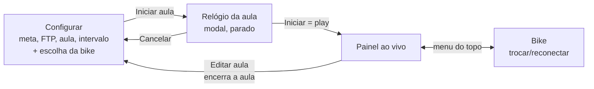

# 1. Visão geral

[← Índice](README.md) · [Próxima: Arquitetura →](02-arquitetura.md)

## O problema

Numa aula de bike indoor você tem uma **meta de calorias** (ex. 700 kcal em 45 min). O mostrador da Keiser só diz quanto você já fez — não diz se você está no ritmo. O app responde, a cada momento: **"estou adiantado ou atrasado pra bater a meta?"**

## As telas

- **Configurar** (`components/SetupView.tsx`): a única tela antes da aula, sem menu no topo. Os parâmetros (meta, FTP, aula, intervalo) e, embaixo, a escolha da bike (`BikePicker`): busca via Bluetooth, bikes detectadas, cadastro e a **Bike simulada**, que está sempre lá.
- **Relógio da aula** (`components/ClockSync.tsx`): um modal por cima da tela, em contagem regressiva como o relógio da sala (40:00, 39:59…). Ao tocar em **Iniciar aula** ele abre **parado** no tempo total; você ajusta até bater com o relógio da aula e toca **Iniciar** (play) na hora em que ela começa. É o play que cria a aula.
- **Painel ao vivo** (`components/LiveView.tsx`): a aula acontecendo.
- **Bike** (`components/BikesView.tsx`): só durante a aula — o mesmo `BikePicker` + "Voltar ao painel", pra trocar ou reconectar a bike sem encerrar a aula.

Durante a aula o topo tem 5 botões: **painel**, **bike**, **relógio** (reabre o modal), **FTP** (um modal: digita ou − / + de 5 em 5) e **editar aula** (pede confirmação, encerra a aula e volta pra Configurar).

Não tem campo de "kcal inicial": no play o app usa a kcal que a bike está mostrando naquele momento. Por isso o **Iniciar aula** só abre o relógio se a bike escolhida estiver respondendo (a simulada sempre responde).

## Vocabulário

| Termo | O que é | No código |
|---|---|---|
| **Marco** (intervalo, bloco) | Um pedaço da aula, ex. do minuto 8 ao 16, com a meta cumulativa no fim dele | `Interval` em `domain/types.ts` |
| **Meta cumulativa** | Quanta kcal você deveria ter no fim do marco (ex. 249 no minuto 16) | `Interval.goal` |
| **Delta** | Quanto fazer só naquele marco (ex. +125) | `intervalDelta()` |
| **Confirmar marco** | Tocar no marco atual quando a aula chega nele; recalcula os próximos com a kcal real | `session.confirm()` |
| **Relógio de referência** | "Em tal instante a aula estava no minuto X". Começa no play do modal do relógio; depois dá pra acertar por um toque num marco ou pelo botão de relógio do topo | `Clock` / `session.clock` |
| **Risco** | Tracinho branco na barra do marco atual: onde você deveria estar, pelo relógio | `timeProgress()` |
| **Previsão** | Kcal estimada no fim da aula, no ritmo médio até agora (a partir dos 5 min, atualizada a cada 15 s) | `domain/forecast.ts`, `store.forecast()` |
| **%FTP / zona** | Watts ÷ FTP; zonas 1–5 por faixa de % | `domain/zones.ts` |
| **Sinal segurado** | Falha curta de leitura não apaga o painel por até 20 s | `store.showBike()` |
| **Nível +50** | Depois da meta, um cartão extra de 50 em 50 kcal | `bonusLevel()` |

## Uma aula, passo a passo

1. Configura 0 → 700 kcal, 45 min, blocos de 8 → marcos 8, 16, 24, 32, 40, 45 com metas 124, 249, 373, 498, 622, 700.
2. Escolhe a bike (ela precisa estar mandando leitura), toca **Iniciar aula**. Abre o relógio parado em `45:00`.
3. A aula começa → toca **Iniciar**. A kcal inicial vira a que a bike mostra (0 aqui), o painel mostra os marcos (o primeiro é o "atual", borda vermelha), o relógio já anda do minuto 0 (risco no começo do primeiro marco, `00:00` ao lado da zona) e o rodapé diz "previsão a partir dos 5 min" (depois dos 5 min aparece o número).
   - Chegou com a aula já em 2:45? Antes do play, toca no tempo grande e digita `42:15` (o que **falta**), ou usa as setas de baixo (minutos à esquerda, segundos à direita; segurando, repetem). O play já sai com o risco a 34% do primeiro marco.
4. No minuto 8 o marco é **concluído sozinho** (o relógio passou do fim). Se você fez 150 kcal (adiantado), os próximos marcos passam a pedir menos.
5. Passou de 700? Aparece um cartão **+50** (750, 800, …).
6. Deu refresh, travou a tela? A aula volta do `localStorage` e o Bluetooth é retomado sozinho.

## Exercícios

1. Abra o app com a Bike simulada, inicie uma aula e, no relógio do topo, deixe faltando `37:10` (aula no minuto 7:50). O que acontece 10 segundos depois? Por quê?
2. Com 8 e 16 concluídos, deixe o relógio faltando `35:00` (minuto 10). Quais marcos ficam concluídos? (Resposta na [página 3](03-dominio.md#syncclock-o-tempo-digitado-manda).)
3. Encontre no código onde está escrito o texto "previsão: acerte o relógio". Se o play já põe o relógio andando, quando esse texto ainda aparece? (Dica: desfazer um marco.)
4. Escolha uma bike que não está mandando leitura e toque em **Iniciar aula**. Que aviso aparece e quando ele some? (`store.requestStart()`.)
