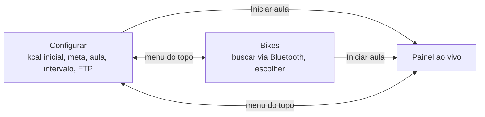

# 1. Visão geral

[← Índice](README.md) · [Próxima: Arquitetura →](02-arquitetura.md)

## O problema

Numa aula de bike indoor você tem uma **meta de calorias** (ex. 700 kcal em 45 min). O mostrador da Keiser só diz quanto você já fez — não diz se você está no ritmo. O app responde, a cada momento: **"estou adiantado ou atrasado pra bater a meta?"**

## As 3 telas

- **Configurar** (`components/SetupView.tsx`): os parâmetros da aula.
- **Bikes** (`components/BikesView.tsx`): cadastro de bikes (só via Bluetooth) e escolha da bike em uso. A **Bike simulada** está sempre lá.
- **Painel ao vivo** (`components/LiveView.tsx`): a aula acontecendo.

No topo ainda há dois botões que abrem um `prompt` nativo: **FTP** (qualquer tela) e **relógio** (só no painel).

## Vocabulário

| Termo | O que é | No código |
|---|---|---|
| **Marco** (intervalo, bloco) | Um pedaço da aula, ex. do minuto 8 ao 16, com a meta cumulativa no fim dele | `Interval` em `domain/types.ts` |
| **Meta cumulativa** | Quanta kcal você deveria ter no fim do marco (ex. 249 no minuto 16) | `Interval.goal` |
| **Delta** | Quanto fazer só naquele marco (ex. +125) | `intervalDelta()` |
| **Confirmar marco** | Tocar no marco atual quando a aula chega nele; recalcula os próximos com a kcal real | `session.confirm()` |
| **Relógio de referência** | "Em tal instante a aula estava no minuto X". Acertado por um toque num marco ou pelo botão de relógio | `Clock` / `session.clock` |
| **Risco** | Tracinho branco na barra do marco atual: onde você deveria estar, pelo relógio | `timeProgress()` |
| **Previsão** | Kcal estimada no fim da aula, no ritmo médio até agora | `domain/forecast.ts` |
| **%FTP / zona** | Watts ÷ FTP; zonas 1–5 por faixa de % | `domain/zones.ts` |
| **Sinal segurado** | Falha curta de leitura não apaga o painel por até 20 s | `store.showBike()` |
| **Nível +50** | Depois da meta, um cartão extra de 50 em 50 kcal | `bonusLevel()` |

## Uma aula, passo a passo

1. Configura 0 → 700 kcal, 45 min, blocos de 8 → marcos 8, 16, 24, 32, 40, 45 com metas 124, 249, 373, 498, 622, 700.
2. Escolhe a bike, toca **Iniciar aula**. O painel mostra os marcos; o primeiro é o "atual" (borda vermelha).
3. A aula está em 2:45 → toca no **relógio** e digita `245`. Aparece o risco no primeiro marco (34% da barra), o tempo `02:45` ao lado da zona e a previsão no rodapé.
4. No minuto 8 o marco é **concluído sozinho** (o relógio passou do fim). Se você fez 150 kcal (adiantado), os próximos marcos passam a pedir menos.
5. Passou de 700? Aparece um cartão **+50** (750, 800, …).
6. Deu refresh, travou a tela? A aula volta do `localStorage` e o Bluetooth é retomado sozinho.

## Exercícios

1. Abra o app com a Bike simulada, inicie uma aula e acerte o relógio em `7:50`. O que acontece 10 segundos depois? Por quê?
2. Com 8 e 16 concluídos, digite `10:00` no relógio. Quais marcos ficam concluídos? (Resposta na [página 3](03-dominio.md#syncclock-o-tempo-digitado-manda).)
3. Encontre no código onde está escrito o texto "previsão: acerte o relógio".
