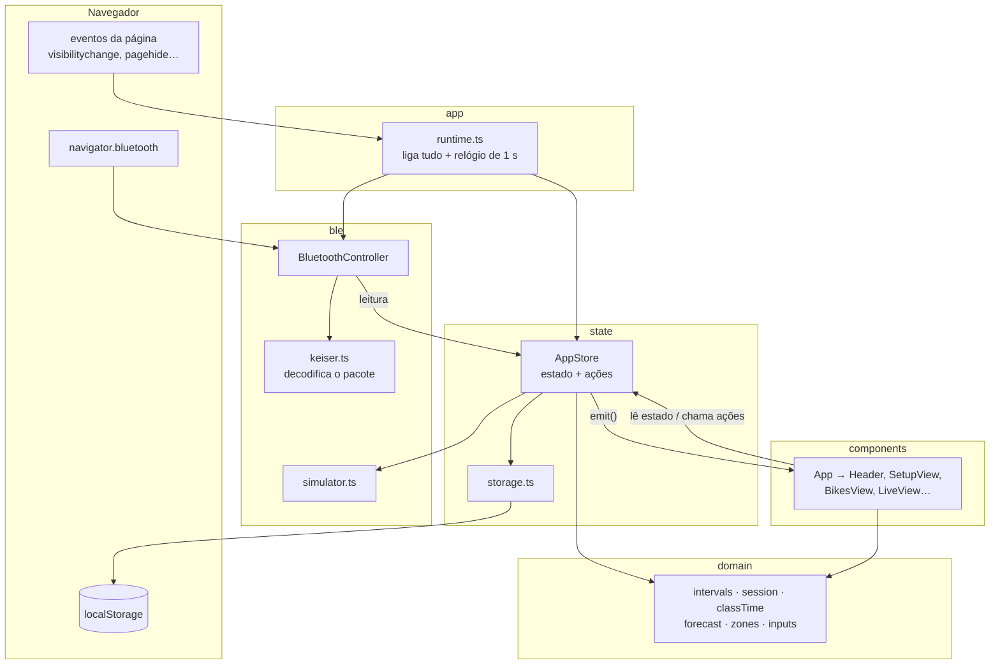
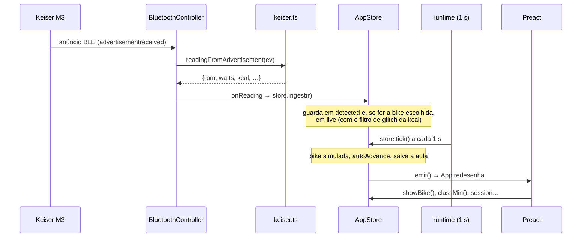

# 2. Arquitetura

[← Visão geral](01-visao-geral.md) · [Índice](README.md) · [Próxima: Domínio →](03-dominio.md)

## As camadas

**Regra de dependência:** as setas só vão "pra dentro".

- `domain/` não importa nada do projeto — só funções puras (entra número, sai número). É a parte mais fácil de testar e a mais importante.
- `ble/` não conhece a tela nem o estado; avisa por callbacks (`onReading`, `onChange`).
- `state/` usa `domain/` e guarda tudo; não conhece Preact nem o Bluetooth real (recebe `now()` e `storage` por injeção).
- `components/` só lê o estado e chama ações.
- `app/runtime.ts` é o único lugar que conhece o navegador de verdade (`window`, `navigator`, `document`) e junta as peças.

Por que assim? Porque dá pra testar `domain/`, `ble/` e `state/` sem navegador (Vitest roda em Node), e trocar a tela sem mexer nos cálculos.

## O caminho de uma leitura da bike até a tela

Repare: no painel, `ingest` **não** redesenha a tela; quem redesenha é o `tick` de 1 s. Assim, com 20 bikes transmitindo na academia, a tela não redesenha 20 vezes por segundo. Na aba Bikes o `ingest` chama `emit()` direto, pra lista de detectadas acompanhar na hora.

## O runtime (`src/app/runtime.ts`)

`createRuntime()` monta e liga:

1. `AppStore` com `localStorage` e `Date.now`.
2. `BluetoothController` com `navigator.bluetooth`, avisando o store a cada leitura.
3. `store.load()` — restaura configuração, bikes e aula.
4. `ble.resume(true)` — retoma bikes já autorizadas.
5. `setInterval` de 1 s: `store.tick()` e, se `needsReconnect()`, `ble.resume(false)`.
6. Eventos: voltar pra tela → retoma Bluetooth e wake lock; esconder → salva aula; `pagehide` → salva e libera o Bluetooth; clique → tenta wake lock.
7. `scan()` — a ação do botão "Buscar bike"/"Reconectar bike", que traduz o resultado do Bluetooth em aviso na tela.

`main.tsx` só faz `render(<App runtime={createRuntime()} />)`.

## Exercícios

1. Por que `AppStore` recebe `now: () => number` em vez de chamar `Date.now()` direto? (Dica: veja `fakeClock` em `src/testing/helpers.ts`.)
2. Tente importar algo de `components/` dentro de `domain/intervals.ts`. Por que isso seria um problema, mesmo compilando?
3. No diagrama de sequência, onde entraria uma leitura da **Bike simulada**? (Resposta: `store.tick()` chama `simStep()` e depois `ingest()`.)
