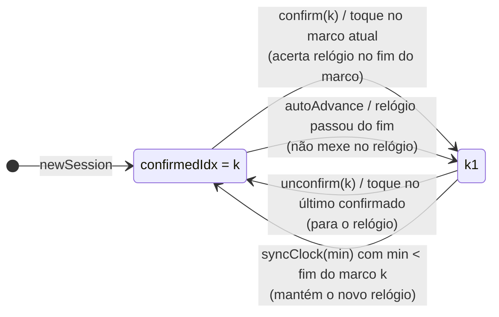

# 3. Domínio: os cálculos

[← Arquitetura](02-arquitetura.md) · [Índice](README.md) · [Próxima: Bluetooth →](04-bluetooth.md)

Tudo aqui está em `src/domain/`, são **funções puras** (mesma entrada → mesma saída, sem efeito colateral) e cada arquivo tem um `*.test.ts` ao lado. Os exemplos usam a aula padrão: **0 → 700 kcal, 45 min, blocos de 8**.

## Tipos (`types.ts`)

```ts
interface ClassPlan { startKcal; goal; total; interval }   // parâmetros da aula
interface Interval  { start; end; baseline; goal }         // um marco: minutos start→end, kcal baseline→goal
interface Clock     { at; min }                            // em Date.now()=at a aula estava no minuto min
```

## Marcos (`intervals.ts`)

### `targetAt(t, plan)` — a linha reta

Meta teórica no minuto `t`: `startKcal + (goal − startKcal) × t/total`, presa entre 0 e 1.
Ex.: `targetAt(16) = 700 × 16/45 = 248,9`.

### `buildIntervals(plan)` — quebrar a aula

Fins dos blocos: 8, 16, 24, 32, 40 e, como 40 < 45, mais um até **45** (o último pode ser menor). Cada marco começa onde o anterior terminou:

| end | baseline | goal | na tela | delta |
|---|---|---|---|---|
| 8 | 0 | 124,4 | 124 kcal | +124 |
| 16 | 124,4 | 248,9 | 249 kcal | +125 |
| 24 | 248,9 | 373,3 | 373 kcal | +124 |
| 32 | 373,3 | 497,8 | 498 kcal | +125 |
| 40 | 497,8 | 622,2 | 622 kcal | +124 |
| 45 | 622,2 | 700 | 700 kcal | +78 |

**Por que o delta alterna 124/125?** `intervalDelta` subtrai os valores **já arredondados** (`round(goal) − round(baseline)`), pra conta bater com o que aparece nos cartões: 249 − 124 = 125.

### `recalcFuture(intervals, fromIdx, actualKcal, plan)` — o coração do app

Ao confirmar o marco `fromIdx`, o que falta de meta é redistribuído **em linha reta** pelo tempo que falta, a partir da kcal **real**:

```
remainingKcal = max(0, goal − actualKcal)
remainingT    = total − intervals[fromIdx].end
novo goal(j)  = actualKcal + remainingKcal × (end_j − fromT) / remainingT
```

Exemplo: no minuto 16 você tinha **300** (a meta era 249 — adiantado). Faltam 400 kcal em 29 min:

| marco | antes | depois | delta novo |
|---|---|---|---|
| 24 | 373 | 300 + 400 × 8/29 = **410** | +110 |
| 32 | 498 | 300 + 400 × 16/29 = **521** | +111 |
| 40 | 622 | 300 + 400 × 24/29 = **631** | +110 |
| 45 | 700 | **700** | +69 |

Adiantado → os próximos pedem **menos** (110 em vez de 124). Se já passou da meta, `remainingKcal = 0` e os próximos ficam na kcal atual (nunca uma meta menor que o feito).

A função **não altera** o array recebido: devolve um novo, reaproveitando os objetos até `fromIdx`. Isso é o que permite guardar o array antigo no histórico pra desfazer.

### Outras

- `kcalProgress(cur, iv)` — fração da barra de kcal (0..1).
- `timeProgress(t, iv)` — posição do risco (0..1).
- `bonusLevel(cur, goal)` — com 760 e meta 700: `{baseline: 750, goal: 800}`.

## A sessão da aula (`session.ts`)

```ts
interface Session { startedAt; intervals; confirmedIdx; history; clock }
```

- `confirmedIdx`: quantos marcos já foram confirmados, **em sequência** (0..6). O marco atual é `intervals[confirmedIdx]`.
- `history`: pilha com as metas de antes de cada confirmação (pra desfazer).
- `clock`: relógio de referência ou `null`.

Todas as funções devolvem uma **nova** sessão (ou a mesma, se nada mudou — o store usa isso pra saber se precisa salvar).



| Função | Quando | Efeito |
|---|---|---|
| `confirm(s, i, kcal, …, auto)` | toque no marco atual (ou avanço automático) | empilha metas, recalcula, `confirmedIdx+1`; toque manual acerta `clock = {at: now, min: end do marco}` |
| `popConfirmed(s)` | interno | volta um marco com as metas do histórico, **mantém** o relógio |
| `unconfirm(s, i)` | toque no último confirmado | `popConfirmed` + `clock = null` |
| `autoAdvance(s, kcal, …)` | todo tick de 1 s e ao carregar | enquanto `classMin ≥ fim do marco atual`, confirma com `auto = true` |
| `syncClock(s, min, kcal, …)` | botão de relógio | ver abaixo |

### `syncClock`: o tempo digitado manda

1. Enquanto o último confirmado **termina depois** de `min`, desfaz (`popConfirmed`).
2. Acerta `clock = {at: now, min}`.
3. `autoAdvance`: conclui os que já terminaram.

Com 8 e 16 concluídos, digitar `10:00`: o 16 termina em 16 > 10 → desfeito; o 8 termina em 8 ≤ 10 → fica. Resultado: 8 concluído, 16 atual, risco a 25% do bloco 8→16. `16:00` exato mantém o 16 concluído (`autoAdvance` usa `≥`).

## Relógio e tempo digitado (`classTime.ts`)

- `classMin(clock, now) = clock.min + (now − clock.at) / 60000` → minuto da aula agora.
- `parseClassTime(texto)`:
  - com separador (`:` `.` `,` `h` espaço): `2:45`, `02 45`, `2.45` → 2 min 45 s;
  - só dígitos com **3+ casas**: os 2 últimos são segundos (`245`, `0245`, `1230`);
  - só dígitos com **1–2 casas**: minutos (`3` = 3 min, `45` = 45 min);
  - segundos ≥ 60 → `null` (inválido).
- `fmtClassTime(min)` → `"MM:SS"`. Tem um `+1e-6` porque `2 + 3/60` em ponto flutuante vale `2,04999…` e viraria `02:02`.

## Previsão (`forecast.ts`)

```
rate     = max(0, kcal_agora − startKcal) / t          (kcal por minuto desde o começo)
previsão = kcal_agora + rate × (total − t)
```

Usa a **média da aula inteira** (não dos últimos minutos) porque a aula alterna zonas de propósito — uma janela curta oscilaria demais. Ex.: 250 kcal em 15 min → 16,7/min → 250 + 16,7 × 30 = **750** → "+50 da meta".

**Fases** (`forecastPhase`) — cada uma com seu rótulo no rodapé:

| Fase | Quando | Rodapé |
|---|---|---|
| `noClock` | relógio não acertado | "previsão: acerte o relógio", sem número |
| `warmup` | menos de **5 min** de aula (`FORECAST_MIN_MINUTES`) | "previsão a partir dos 5 min", sem número — no começo o ritmo médio oscila demais (aquecimento, primeiro sprint) |
| `active` | de 5 min até o fim | a previsão e a diferença pra meta |
| `ended` | depois do fim | "total da aula" = a kcal feita |

**Atualização a cada 15 s** (`store.forecast()`, `FORECAST_REFRESH_MS`): o número mudando todo segundo distrai. O store guarda a última previsão e só recalcula depois de 15 s — **ou na hora** se mudar algo que muda o sentido dela: a fase, o relógio (acertado/desfeito) ou o plano (meta, duração, kcal inicial). Na fase `ended` acompanha a kcal ao vivo. A regra dos 5 min é do domínio (pura, testada em `forecast.test.ts`); o ritmo de atualização é do store (depende do tempo, testado em `store.test.ts`).

## Zonas e velocímetro (`zones.ts`)

- `ftpPercent(watts, ftp) = round(watts / ftp × 100)`.
- `ftpZone(pct)`: ≤55 → 1, ≤75 → 2, ≤89 → 3, ≤105 → 4, acima → 5.
- **Velocímetro com fatias iguais:** cada zona ocupa 1/5 do arco, mesmo a zona 1 (0–55%) sendo bem maior que a 3 (76–89%). Assim dá pra ver onde você está **dentro** da zona.

```
GAUGE_ZONES = [0–55,5] [55,5–75,5] [75,5–89,5] [89,5–105,5] [105,5–150]
gaugeFrac(pct, z) = (z − 1 + (pct − lo) / (hi − lo)) / 5
```

Ex.: 100% → zona 4 → `(3 + (100 − 89,5)/16) / 5 = 0,731` → ponteiro a **131,6°** (de 0° à esquerda a 180° à direita). Os limites estão no "meio do inteiro" (55,5 e não 55) pra um valor arredondado nunca cair na faixa da zona vizinha. Acima de 150% o ponteiro para no fim.

`gaugeGeometry()` gera os caminhos SVG das 5 faixas (arco de raio 82 centrado em 100,100) e as posições dos rótulos 55/75/90/105.

## Entradas (`inputs.ts`)

- `guardKcal(anterior, nova)`: leitura **zerada ou menor** que a anterior é descartada (glitch do Bluetooth).
- `parseFtpInput(texto)`: aceita vírgula (`199,6` → 200), rejeita vazio, texto e negativo.

## Exercícios

1. Calcule à mão as metas se no minuto 8 você tivesse só **80 kcal** (atrasado). Confira com um teste em `intervals.test.ts`.
2. Por que `recalcFuture` usa `.map` e cria objetos novos em vez de alterar `iv.goal` direto? O que quebraria no "desfazer"?
3. Escreva um teste para `parseClassTime('1h05')`. O que ele devolve? Faz sentido?
4. Com FTP 200 e 180 W, em que ângulo fica o ponteiro? (90% → zona 4 → `(3 + 0,5/16)/5 × 180`.)
