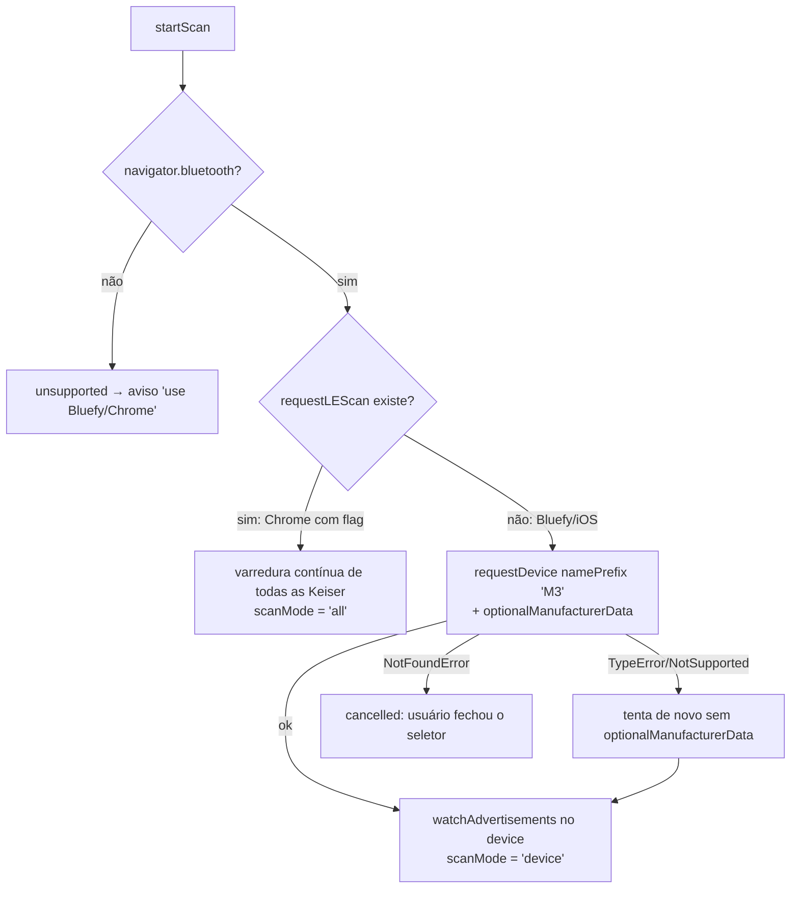

# 4. Bluetooth e a Keiser

[← Domínio](03-dominio.md) · [Índice](README.md) · [Próxima: Estado →](05-estado-e-persistencia.md)

## Como a Keiser M3 fala

A M3 **não pareia**: ela fica transmitindo **anúncios BLE** (broadcast) várias vezes por segundo, com os dados no campo *manufacturer data* identificado pelo company id **`0x0102`**. Qualquer um por perto pode ouvir — por isso o app vê todas as bikes da academia e você escolhe a sua pelo número.

## O pacote de 17 bytes (`ble/keiser.ts` → `parseKeiser`)

| Byte | Campo | Tipo | Observação |
|---|---|---|---|
| 0–1 | (versão) | — | não usado |
| 2 | tipo | uint8 | `0` = tempo real; outros valores são ignorados |
| 3 | id | uint8 | número da bike no console ("Bike 7") |
| 4–5 | rpm | uint16 LE | ÷ 10 |
| 6–7 | FC | uint16 LE | ÷ 10 |
| 8–9 | watts | uint16 LE | |
| 10–11 | kcal | uint16 LE | acumulada |
| 12 / 13 | min / seg | uint8 | tempo no console |
| 14–15 | distância | uint16 LE | bits 0–14 ÷ 10; bit 15 = km (1) ou mi (0) |
| 16 | marcha | uint8 | |

*LE = little-endian*: `getUint16(4, true)`.

### Cada navegador entrega de um jeito (`manufacturerPayload`)

- Chrome: `ev.manufacturerData` é um `Map` → `.get(0x0102)`.
- Bluefy/iOS: pode vir objeto indexado, `DataView` ou `ArrayBuffer` direto.
- Alguns "bridges" incluem os 2 bytes do company id antes do payload (19 bytes começando com `0x0102`) → o código pula esses 2.

Os testes em `keiser.test.ts` cobrem cada variação — são a melhor documentação disso.

## `BluetoothController` (`ble/bluetooth.ts`)

A API Web Bluetooth não tem tipos no TypeScript, então o arquivo declara os tipos mínimos (`BleDevice`, `BluetoothApi`, `LeScan`). O controlador recebe tudo por injeção:

```ts
new BluetoothController({ bluetooth: () => navigator.bluetooth, now, isHidden, onReading, onChange })
```

### Buscar (`startScan`) — dois caminhos



O resultado volta como `ScanResult` (`unsupported`, `cancelled`, `started`, `error`) e o `runtime.scan()` transforma em aviso na tela (`store.showNoBle()` / `store.bleError()`).

### Reconexão (`resume`)

No iPhone, travar a tela, ir pro background ou dar refresh **para a escuta sem avisar**. Estratégia:

- `resume(force)` junta as bikes já ouvidas + as que o navegador lembra (`bluetooth.getDevices()`) e **reinicia** `watchAdvertisements` em cada uma (aborta a anterior com `AbortController`, tira e põe o listener — sem duplicar).
- Chamado com `force = true` ao abrir a página e ao voltar pra tela; com `force = false` a cada tick sem sinal, respeitando `RESUME_MS` (10 s) entre tentativas.
- Não faz nada com a página escondida.
- `release()` no `pagehide`: libera a escuta pra página nova (após refresh) conseguir assumir a bike.

## Sinal: 4 s e 20 s

Cada leitura da bike escolhida grava `live.lastSeen = now`. O store deriva:

```
sem leitura há:  0s ─────── 4s ──────────────────────── 20s ──────────────▶
hasBike()        ██████████│
retomada auto.              │ tenta reconectar (no máx. a cada 10 s) ───────▶
showBike()       ███████████████████████████████████████│
painel           valores normais                          │ "–", sem sinal, Reconectar
```

- `hasBike()` — leitura há menos de **4 s** (`STALE_MS`). Abaixo disso, `needsReconnect()` fica verdadeiro e o runtime chama `ble.resume(false)`.
- `showBike()` — leitura há menos de **20 s** (`HOLD_MS`). O painel usa este: rpm, watts e %FTP continuam com o último valor; depois viram "–", a zona some e aparecem "sem sinal" e "Reconectar bike".
- A **kcal nunca some** (é acumulada).

## Filtro de glitch da kcal

Em `store.ingest`: se a leitura vier **zerada ou menor** que a anterior, mantém a anterior (`guardKcal`). Exceção: logo depois de um refresh (`kcalRestored`), a primeira leitura real **substitui** sem filtro — a bike pode ter sido reiniciada e a kcal salva não vale mais.

## Bike simulada (`ble/simulator.ts`)

`SIM_ID = -1`. A cada tick, `simStep` gera uma leitura: giro oscilando 64–84 rpm (`74 + sin(now/3000)×10`), watts = `rpm × 2,3 + marcha × 4`, kcal subindo devagar. Passa pelo mesmo `ingest` das bikes reais — por isso serve pra testar o app inteiro sem Bluetooth.

## Exercícios

1. Monte à mão os bytes de um pacote com 85,5 rpm, 200 W e 312 kcal (dica: `keiserPacket` em `src/testing/helpers.ts`).
2. Por que `watchDevice` chama `removeEventListener` antes de `addEventListener`? O que o teste "reiniciar não duplica o listener" verifica?
3. Mude `HOLD_MS` para 10 s. Quais testes quebram? (Página 9 tem a receita.)
