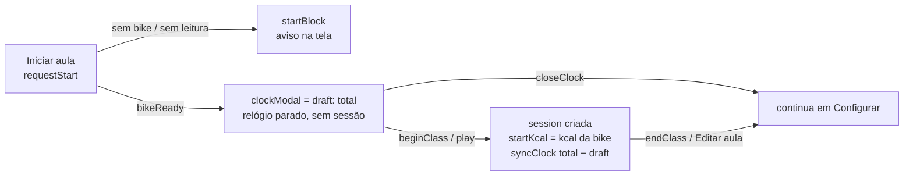

# 5. Estado e persistência

[← Bluetooth](04-bluetooth.md) · [Índice](README.md) · [Próxima: Interface →](06-interface.md)

## O `AppStore` (`src/state/store.ts`)

Uma classe que guarda **todo** o estado do app e expõe **todas** as ações. Não conhece Preact nem o Bluetooth real — recebe por injeção:

```ts
new AppStore({ storage: localStorage, now: () => Date.now(), isListening: () => ble.listening })
```

### Campos

| Campo | O que guarda |
|---|---|
| `view` | tela atual: `'setup' \| 'bikes' \| 'live'` (`'bikes'` = aba Bike, só durante a aula) |
| `cfg` | configuração em números (`goal`, `total`, `interval`, `startKcal`, `ftp`, `chosen`) — `startKcal` não é digitado: o play grava a kcal da bike |
| `inputs` | **texto** digitado nos campos da tela Configurar (`Field` = `'goal' \| 'total' \| 'interval' \| 'ftp'`, ver abaixo) |
| `bikes` | cadastro: `[7, 12]` |
| `live` | última leitura da bike escolhida + `lastSeen` |
| `detected` | `Map` id → última leitura de **todas** as bikes ouvidas |
| `session` | a aula em andamento (`Session` da página 3) ou `null` |
| `notice` | aviso junto da escolha da bike, na tela Configurar ou na aba Bike (sem Bluetooth / erro) |
| `startBlock` | por que o "Iniciar aula" não abriu o relógio: `'noBike'` (nenhuma escolhida) ou `'noSignal'` (a escolhida não está respondendo); some quando a bike manda leitura ou você escolhe outra |
| `clockModal` | modal do relógio aberto (`{ draft }`) ou `null`. `draft` = tempo que **falta** (min) enquanto o relógio está parado: antes do play ou depois de desfazer um marco |
| privados | `kcalRestored`, `savedKcal`, `sim` |

**Por que `inputs` separado de `cfg`?** Se o campo fosse ligado direto ao número, apagar o "45" pra digitar "50" faria o campo virar "1" na hora (o mínimo da aula). Então o campo mostra o texto e o `cfg` guarda o número já validado (`parseField`: aula e intervalo ≥ 1; FTP ≥ 0).

### Ações

| Grupo | Ações |
|---|---|
| navegação | `nav(view)` (sem aula é sempre Configurar; com aula, pedir Configurar cai no painel — só se volta pra lá encerrando) |
| configuração | `setInput(campo, texto)`, `openFtp()`, `closeFtp()`, `setFtp(n)` (salva e fecha o modal de FTP) |
| bikes | `selectBike(id)`, `addBike(id)`, `deleteBike(id)`, `detectedNew()` |
| leituras | `ingest(reading)` |
| avisos | `showNoBle()`, `bleError(e, hasBle)` (vai pra aba Bike na aula, fica em Configurar fora dela), `clearNotice()` |
| aula | `requestStart()`, `beginClass()`, `endClass()`, `confirmInterval(i)`, `unconfirmInterval(i)`, `syncClock(min)`, `saveClass()` |
| modal do relógio | `openClock()`, `closeClock()`, `shiftRemaining(Δmin)`, `setRemaining(min)` |
| relógio | `tick()` — chamado pelo runtime a cada 1 s |
| consultas | `hasBike()`, `bikeReady()`, `showBike()`, `needsReconnect()`, `classActive()`, `classMin()`, `remaining()`, `clockRunning()`, `connStatus()`, `forecast()` (previsão com cache de 15 s) |

### Começar e encerrar a aula



- `requestStart()` valida os campos pro `cfg` e checa `bikeReady()` (simulada ou `hasBike()`). Não cria sessão: só abre o modal com `draft = total`.
- Com o relógio parado, `shiftRemaining`/`setRemaining` mexem só no `draft` (preso entre 0 e o total, em segundos inteiros). Com o relógio andando, viram `syncClock(total − falta)` na hora.
- `beginClass()` (play): sem sessão, grava `startKcal` = kcal atual da bike, cria a sessão e vai pro painel; em qualquer caso fecha o modal e chama `syncClock(total − draft)` — a aula já nasce com o relógio andando.
- `openClock()` (botão de relógio do topo): se o relógio estiver parado (depois de desfazer um marco), o `draft` começa no fim do último marco concluído.
- `askEndClass()` ("Editar aula") só liga `endModal` (a confirmação); `cancelEndClass()` desliga. `endClass()` (confirmou): zera `session` e fecha os modais, apaga a aula salva (`storage.clearClass`) e volta pra Configurar.

### Como a tela fica sabendo

Padrão *observer* bem simples:

```ts
subscribe(fn)  // registra; devolve a função pra cancelar
emit()         // chama todos os inscritos
```

Toda ação que muda algo termina com `this.emit()`. O componente `App` é o **único** inscrito e redesenha a árvore inteira (é barato: a tela é pequena).

As ações da aula passam por `updateSession(fn)`: aplica a função pura do domínio, e **só se a sessão mudou** salva e emite.

### `tick()` a cada 1 s

1. Se a bike é a simulada: gera uma leitura (`simStep`) e faz `ingest`.
2. Se há aula: `autoAdvance` (conclui marcos pelo relógio) e salva se mudou; salva também se a kcal mudou desde o último save.
3. `emit()`.

## Persistência (`src/state/storage.ts`)

Três chaves no `localStorage` — **as mesmas da versão antiga (arquivo único)**, então nada se perde na migração:

| Chave | Conteúdo |
|---|---|
| `ritmoQueimaCfg` | `{"goal":700,"total":45,"interval":8,"startKcal":0,"ftp":150,"chosen":7}` |
| `ritmoQueimaBikes` | `[7,12]` — aceita também o formato antigo `[{"bikeId":7,"name":"…"}]` |
| `ritmoQueimaAula` | `{startedAt, intervals, confirmedIdx, history, clock, kcal}` |

Regras:

- Leitura e escrita dentro de `try/catch`: aba privada ou armazenamento cheio não quebram o app.
- `loadConfig` ignora campos que não são número.
- `loadClass` **valida a estrutura** (marcos com números, índice dentro do limite); quem decide se a aula ainda vale é o store: só restaura até **60 min depois do fim previsto** (`CLASS_GRACE_MIN`).
- Ao restaurar, `load()` já roda `autoAdvance` (se você fechou o app no minuto 7 e voltou no 12, o marco 8 aparece concluído) e vai direto pro painel.

### Quando salva

- `saveCfg` a cada campo alterado, FTP e seleção de bike.
- `saveClass` a cada ação da aula (inclusive o play), a cada tick em que a kcal mudou, ao esconder a página e no `pagehide`.
- `clearClass` ao encerrar a aula ("Editar aula"): um refresh depois disso não traz a aula de volta.

## Exercícios

1. No DevTools (aba Application → Local Storage), inicie uma aula e confirme o marco 8. Compare `history` antes e depois.
2. Por que `ingest` só chama `emit()` quando `view !== 'live'`?
3. Abra o modal do relógio, dê **Cancelar** e olhe o `ritmoQueimaAula` no DevTools. Por que não tem nada lá? E depois do play?
4. Escreva um teste em `store.test.ts`: "trocar de bike no meio da aula (aba Bike) zera a kcal" — está certo esse comportamento? (Veja o comentário em `selectBike`.)
