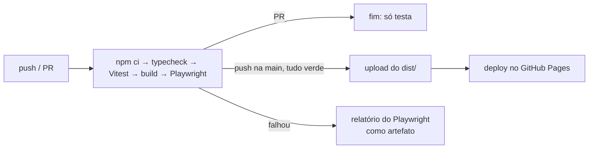

# 8. Build e publicação

[← Testes](07-testes.md) · [Índice](README.md) · [Próxima: Receitas →](09-receitas.md)

## Ferramentas

| Ferramenta | Papel | Config |
|---|---|---|
| **Vite** | servidor de desenvolvimento e build | `vite.config.ts` |
| **TypeScript** | tipos (só checagem; quem compila é o Vite) | `tsconfig.json` |
| **@preact/preset-vite** | JSX do Preact e recarga rápida | `vite.config.ts` |
| **Vitest** | testes unitários | bloco `test` do `vite.config.ts` |
| **Playwright** | testes de fluxo | `playwright.config.ts` |

## Scripts (`package.json`)

| Comando | Faz |
|---|---|
| `npm run dev` | app em `http://localhost:5173`, recarrega ao salvar |
| `npm run build` | checa tipos e gera `dist/` |
| `npm run preview` | serve o `dist/` localmente (`:4173`) |
| `npm run typecheck` | só os tipos |
| `npm test` / `npm run test:watch` | Vitest |
| `npm run test:e2e` | Playwright (faz o build e sobe o preview sozinho) |
| `npm run check` | tipos + Vitest + Playwright |
| `npm run screenshots` | build + regera `screenshots/*.png` (`scripts/screenshots.mjs`) |

## Pontos do `vite.config.ts`

- `base: './'` — caminhos relativos no `dist/`, então o mesmo build funciona em `…github.io/calorie-burn/` ou na raiz de qualquer host.
- `build.target: 'safari14'` — o Bluefy usa o WebKit do iOS; o código é convertido pra rodar lá.
- `define: { __APP_VERSION__ }` — lê a versão do `package.json` e injeta no rodapé ("Versão 4.0.0"). Pra mudar a versão, mude só o `package.json`.

## O `dist/`

```
dist/
  index.html
  assets/index-<hash>.js    (~15 KB comprimido: Preact + app)
  assets/index-<hash>.css   (~3 KB)
```

O `<hash>` muda quando o conteúdo muda → o navegador nunca usa JS velho do cache.

## CI e publicação (`.github/workflows/ci.yml`)



**Configuração única no GitHub:** Settings → Pages → Build and deployment → Source = **GitHub Actions**. Sem isso o Pages continua servindo o `index.html` da raiz, que agora depende do build — o site quebraria.

## Versão

Siga a ideia do [SemVer](https://semver.org/lang/pt-BR/): mudança visível/nova função → sobe o do meio (4.**1**.0); correção → o último (4.0.**1**); algo que muda o jeito de usar ou os dados salvos → o primeiro.

## Exercícios

1. Rode `npm run build` e abra `dist/index.html`. Por que abrir o arquivo direto (`file://`) não funciona com o Bluetooth?
2. Mude a versão pra 4.0.1 no `package.json` e veja o rodapé no `npm run dev`.
3. No CI, por que o deploy é um job separado (`deploy`) que depende do `test`?
