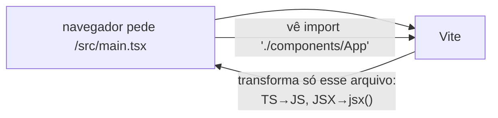

# 13. npm, Node e Vite

[← Preact e JSX](12-preact-e-jsx.md) · [Índice](README.md) · [Próxima: Web Bluetooth →](14-web-bluetooth-e-ble.md)

## Node e npm

- **Node.js** roda JavaScript fora do navegador. Aqui ele não roda o app — roda as **ferramentas** (Vite, TypeScript, Vitest, Playwright).
- **npm** baixa bibliotecas (pacotes) e roda scripts.

### `package.json`

```json
{
  "name": "ritmo-de-queima",
  "version": "4.0.0",
  "type": "module",
  "scripts": { "dev": "vite", "build": "tsc --noEmit && vite build", … },
  "dependencies":    { "preact": "^10.29.8" },
  "devDependencies": { "vite": "^8.3.1", "typescript": "…", "vitest": "…", … }
}
```

- `dependencies`: vai pro app final (só o Preact!).
- `devDependencies`: só pra desenvolver/testar/buildar.
- `"type": "module"`: arquivos `.js`/`.mjs` do projeto usam `import`/`export`.
- `^10.29.8` (semver): aceita atualizações **compatíveis** (10.x.y ≥ 10.29.8, não 11).
- `scripts`: `npm run build` roda `tsc --noEmit && vite build` (o `&&` só roda o segundo se o primeiro passar).

### `package-lock.json` e `node_modules/`

- `node_modules/` é onde os pacotes são baixados (fora do git, no `.gitignore`).
- `package-lock.json` registra a **versão exata** de cada pacote (e das dependências deles). Vai pro git: garante que você, o CI e qualquer outra máquina instalem exatamente o mesmo.
- `npm install` — instala e pode atualizar o lock. `npm ci` (usado no CI) — instala **exatamente** o lock, do zero.
- `npx comando` — roda um executável de `node_modules/.bin` (ex.: `npx playwright test`).

## Vite

O Vite tem dois modos bem diferentes:

### `npm run dev` — servidor de desenvolvimento



- **Não empacota nada**: serve cada arquivo como módulo ES, transformando TypeScript/JSX na hora. Por isso sobe em milissegundos.
- **HMR** (*Hot Module Replacement*): ao salvar um arquivo, o Vite manda pelo WebSocket só o módulo alterado; com o Prefresh, o componente atualiza sem perder o estado.
- CSS importado no JS (`import './global.css'` no `main.tsx`, `import s from './FtpGauge.module.css'` nos componentes) vira uma tag `<style>` injetada. Arquivos `*.module.css` são **CSS Modules**: o Vite renomeia cada classe (`.pct` → `_pct_1x2y3`) e devolve o objeto `s` com os nomes novos ([página 17](17-svg-e-css.md#css-modules-um-arquivo-por-componente)).

### `npm run build` — build de produção

1. `tsc --noEmit` checa os tipos (o Vite não checa tipos — só remove).
2. `vite build`:
   - parte do `index.html`, segue os imports a partir de `/src/main.tsx`;
   - **empacota** (*bundle*) tudo num arquivo JS — menos requisições;
   - **tree-shaking**: remove código não usado;
   - **minifica**: nomes curtos, sem espaços;
   - **transpila** pro `target: 'safari14'` (Bluefy/iOS);
   - extrai o CSS pra um arquivo;
   - põe um **hash** no nome (`index-B2khig41.js`) → cache eterno sem risco de versão velha;
   - reescreve o `index.html` apontando pros arquivos finais.

Resultado: `dist/` com ~15 KB de JS comprimido, que qualquer servidor estático serve.

### `npm run preview`

Serve o `dist/` como estaria em produção. Os testes de fluxo usam ele (`playwright.config.ts` → `webServer`), pra testar **o que vai pro ar**, não o modo dev.

## O `vite.config.ts`

```ts
export default defineConfig({
  base: './',                                   // caminhos relativos no dist/
  plugins: [preact()],                          // JSX do Preact + Prefresh
  define: { __APP_VERSION__: JSON.stringify(version) },  // troca o texto no código pelo valor
  build: { target: 'safari14' },
  test: { include: ['src/**/*.test.ts'] },      // configuração do Vitest (mesmo arquivo)
});
```

- `base: './'`: o site fica em `…github.io/calorie-burn/`, não na raiz. Caminhos relativos funcionam em qualquer subpasta.
- `define`: substituição **textual** no build. `__APP_VERSION__` no código vira `"4.0.0"`.
- `defineConfig` vem de `vitest/config` pra aceitar o bloco `test`.

## Exercícios

1. Rode `npm run build` e abra o JS em `dist/assets/`. Procure por `"previsão no fim da aula"`. O que aconteceu com os nomes das funções?
2. Com `npm run dev` rodando e o painel aberto, mude uma cor em `global.css` ou num `*.module.css`. A página recarregou inteira?
3. Por que `preact` está em `dependencies` e `vite` em `devDependencies`, se os dois são necessários pro build?

**Pra aprofundar:** [Vite — Guia](https://vite.dev/guide/) · [Por que Vite](https://vite.dev/guide/why) · [npm — package.json](https://docs.npmjs.com/cli/configuring-npm/package-json) · [semver](https://semver.org/lang/pt-BR/)
