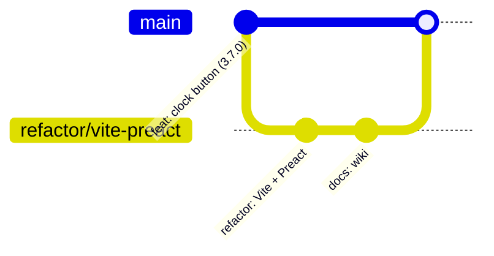

# 19. Git, GitHub Actions e GitHub Pages

[← Testes](18-testes-conceitos-e-ferramentas.md) · [Índice](README.md) · [Próxima: Como as coisas acontecem →](20-como-as-coisas-acontecem.md)

## Git: o que aconteceu na migração



- **commit**: uma foto do projeto com mensagem. O projeto usa [Conventional Commits](https://www.conventionalcommits.org/pt-br/): `feat:` (função nova), `fix:` (correção), `refactor:` (reorganização sem mudar comportamento), `docs:`.
- **branch**: uma linha de trabalho separada. A migração foi feita em `refactor/vite-preact` pra `main` (que publica) não ser afetada até a validação.
- **merge fast-forward**: como a `main` não tinha nada novo, o merge só "avançou o ponteiro" da `main` até o último commit da branch — sem commit de merge.
- **push**: envia os commits pro GitHub. Push na `main` dispara a publicação.

Comandos do dia a dia:

```bash
git status
```

```bash
git switch -c minha-mudanca
```

```bash
git add -A && git commit -m "feat: mostra FC no painel"
```

```bash
git push -u origin minha-mudanca
```

## GitHub Actions: anatomia do `ci.yml`

GitHub Actions roda **workflows** (arquivos YAML em `.github/workflows/`) em máquinas do GitHub quando algo acontece no repositório.

```yaml
name: CI e publicação
on:                              # QUANDO roda
  push: { branches: [main] }
  pull_request:
  workflow_dispatch:             # botão "Run workflow" manual

permissions: { contents: read }  # o mínimo necessário (segurança)

concurrency:                     # um novo push cancela a execução antiga do mesmo branch
  group: ci-${{ github.ref }}
  cancel-in-progress: true

jobs:
  test:                          # job 1
    runs-on: ubuntu-latest       # máquina Linux nova a cada vez
    steps:
      - uses: actions/checkout@v4          # "uses" = ação pronta (baixa o código)
      - uses: actions/setup-node@v4        # instala o Node 22, com cache do npm
      - run: npm ci                        # "run" = comando de terminal
      - run: npm run typecheck
      - run: npm test
      - run: npm run build
      - run: npx playwright install --with-deps chromium
      - run: npm run test:e2e
      - uses: actions/upload-pages-artifact@v3   # empacota o dist/ (só na main)
        if: github.event_name != 'pull_request' && github.ref == 'refs/heads/main'

  deploy:                        # job 2
    needs: test                  # só roda se o job test passou
    permissions: { pages: write, id-token: write }
    environment: github-pages
    steps:
      - uses: actions/deploy-pages@v4      # publica o pacote
```

Conceitos:

- **job** = uma máquina; **step** = um passo. Se um step falha, o job para.
- `needs:` cria dependência entre jobs → **nunca publica com teste quebrado**.
- `if:` condiciona (PR só testa; push na `main` testa e publica).
- `${{ … }}` são expressões com dados do evento (`github.ref` = branch).
- `permissions` por job: só o `deploy` pode escrever no Pages.
- No CI a variável `CI=true` existe → o `playwright.config.ts` usa o Chromium baixado (em vez do seu Chrome), `retries: 1` e `forbidOnly`.

## GitHub Pages

Hospedagem estática grátis em `https://<usuário>.github.io/<repo>/`, com HTTPS (necessário pro Bluetooth).

Duas formas de publicar:

| Source | Como | Serve |
|---|---|---|
| Deploy from a branch (o jeito antigo do projeto) | publica os arquivos do branch como estão | o `index.html` único funcionava assim |
| **GitHub Actions** (o atual) | um workflow gera e envia o site | o `dist/` do build |

Por isso foi preciso trocar a **Source** antes do merge: com "branch", o Pages serviria o `index.html` de desenvolvimento (que aponta pra `/src/main.tsx`, inexistente no ar).

## Exercícios

1. Abra a aba **Actions** do repositório e encontre a execução do merge. Quanto tempo levou cada step?
2. Crie uma branch, quebre um teste de propósito, abra um PR e veja o CI falhar sem publicar.
3. Por que `npm ci` e não `npm install` no CI?

**Pra aprofundar:** [Pro Git (livro, pt-BR)](https://git-scm.com/book/pt-br/v2) · [GitHub Actions — Docs](https://docs.github.com/pt/actions) · [GitHub Pages com Actions](https://docs.github.com/pt/pages/getting-started-with-github-pages/configuring-a-publishing-source-for-your-github-pages-site)
